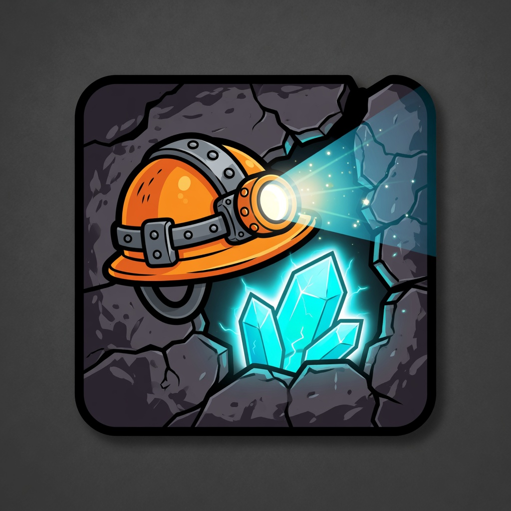
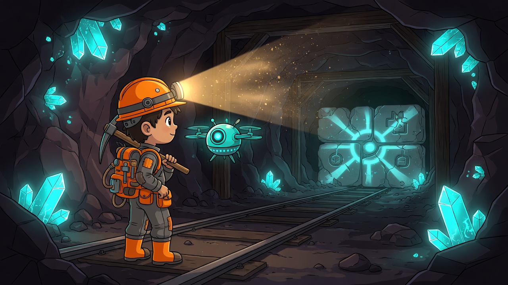
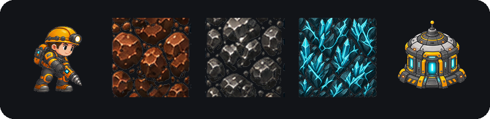
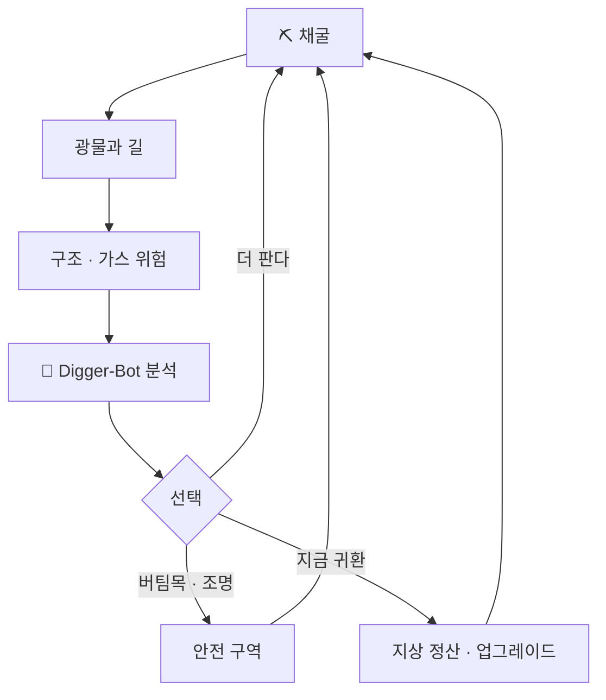

<p align="center">
  
</p>

<h1 align="center">Project Sub-Terra</h1>

<p align="center">
  <em>멸망한 지구에서, 유일한 광부가 인류를 다시 깨운다.</em>
</p>

<p align="center">
  
  
  
  
  
</p>

<p align="center">
  
</p>

<p align="center">
  2D 횡스크롤 · 지하 탐사 · 채굴 · 위험 관리 · 기지 건설
</p>

---

> 인류도 끝났고, 쌓아 둔 자원도 바닥난 세계.  
> 남은 것은 광부 한 명과, 그 광부를 받쳐 줄 첨단 기술뿐이다.
>
> 당신은 멸망한 지구의 유일한 광부이자, 지상에 남은 유일한 개척자다.  
> Digger-Bot과 함께 아래로 내려가 광물을 캐고, 그 광물로 지원 시설을 세운다.  
> 시설은 배양시설이 되고, 배양시설은 인류를 다시 깨운다.  
> 깨어난 인류와 함께 더 넓은 우주로 향하는 것. 그것이 목적이다.
>
> **멸망한 인류를 깨우는 이야기를, 당신이 만든다.**

<p align="center">
  
</p>

<p align="center">
  <sub>광부 · 구리 · 철 · 리튬 · 전진기지</sub>
</p>

---

## 목차

- [한 번의 하강](#한-번의-하강)
- [지금은 40미터](#지금은-40미터)
- [세계가 움직이는 방식](#세계가-움직이는-방식)
- [조작](#조작)
- [실행](#실행)
- [저장소](#저장소)

---

## 한 번의 하강

땅을 파는 일은 길을 열고 광물을 가져온다.  
동시에 암반을 약하게 만들고, 가스와 붕괴를 부른다.



Digger-Bot은 게임을 대신 하지 않는다.  
깊이, 전력, 구조 안정도, 가스, 화물, 귀환 거리를 읽고 **근거와 함께 추천만** 한다.  
내려갈지 올라올지는 광부인 당신이 정한다.

한 상자 광물이 드릴이 되고, 전력이 되고, 지상의 불을 하루 더 켠다.  
그 불이 배양시설이 되고, 배양시설이 다시 인류가 되는 것이 이 게임의 먼 끝이다.

---

## 지금은 40미터

큰 목적은 지구를 넘어 우주로 향하는 것이다.  
지금 플레이할 수 있는 장은 **멸망한 지구의 마지막 폐광, 첫 40m**다.

```text
  지상  ▓▓▓░░░░░░░░░░░░░   개척 전초기지
 1~35m  ▓▓▓▓▓▓▓▓▓░░░░░░░   천층 폐광 · 구리 · 철
36~40m  ▓▓▓▓▓▓▓▓▓▓▓▓▓▓▓▓   심층 · 리튬 · 봉인 신호
         └────── 해금 전엔 여기서 막힌다 ──────┘
```

|  깊이  | 구역             | 지금 할 수 있는 일                        |
| :----: | ---------------- | ----------------------------------------- |
|  지상  | 개척 전초기지    | 광물 판매 · 제작 · 업그레이드 · 탐사 출발 |
| 1~35m  | 천층 폐광        | 구리 · 철 채굴, 버팀목과 조명, 전력 관리  |
| 36~40m | 심층 _(해금 후)_ | 리튬, 그리고 봉인 너머의 문양             |

해금 전에는 36m에서 막힌다. 누군가 그 아래를 봉인했다.  
누가, 왜 막았는지는 아직 말하지 않는다. 신호가 먼저 온다.  
해금 후 회색 돌에 문양이 뜨면, 캐서 **엔진 연료**를 얻는다. 지상에서 희귀 품목으로 판다. 우주선은 정식 버전에서 추후 구현될 예정이다.

<details>
<summary><strong>이 빌드에 있는 것 / 아직 없는 것</strong></summary>

<br>

**있는 것**

이동과 방향 채굴 · 구조 균열과 부분 붕괴 · 가스 · 버팀목 · 조명 · 충전기 · 전진기지 · 전력 · 인벤토리와 판매 · 드릴·드론 업그레이드 · Digger-Bot 분석 · 로컬 세이브와 이어하기

**아직 없는 것**

배양시설과 인구 재생 · 다른 행성 · 완성형 스토리 캠페인 · 멀티플레이 · 무한 월드

그건 다음 장이다. 지금은 그 장을 열 첫 광물을 캐는 일이다.

</details>

---

## 세계가 움직이는 방식

|     | 시스템     | 한 줄                                                                       |
| :-: | ---------- | --------------------------------------------------------------------------- |
| ⛏️  | **채굴**   | 방향을 정해 판다. 드릴과 전력이 없으면 더 단단한 암반은 열리지 않는다.      |
| 💥  | **위험**   | 팔수록 구조가 흔들린다. 균열, 낙석, 가스는 귀환을 고민하게 만드는 압력이다. |
| 🧱  | **건설**   | 버팀목과 조명과 충전기로 위험한 구멍을 안전한 전진 경로로 바꾼다.           |
| 🪙  | **경제**   | 구리, 철, 리튬을 지상에서 바꾼다. 엔진 연료는 희귀 품목으로만 판다. 미정산 화물은 돌아오지 못하면 잃는다. |
| 🤖  | **드론**   | Digger-Bot은 상태를 읽고 말한다. 결과는 항상 플레이어의 선택이다.           |
| 💾  | **세이브** | 로컬 JSON, 스키마 v2. 월드와 진행, 기지 상태가 이어진다.                    |

상세 수치와 데이터 모델은 코드와 [`init/PRD.md`](init/PRD.md)가 정본이다.

---

## 조작

설정에서 키보드 배치를 고를 수 있다. 기본값은 **1번**.

| 배치  | 이동                                                            | 채굴                                                            |
| :---: | --------------------------------------------------------------- | --------------------------------------------------------------- |
| **1** | <kbd>W</kbd> <kbd>A</kbd> <kbd>S</kbd> <kbd>D</kbd> 또는 방향키 | 마우스 클릭 / <kbd>Enter</kbd>                                  |
| **2** | <kbd>W</kbd> <kbd>A</kbd> <kbd>S</kbd> <kbd>D</kbd>             | 방향키로 인접 블록                                              |
| **3** | 방향키                                                          | <kbd>W</kbd> <kbd>A</kbd> <kbd>S</kbd> <kbd>D</kbd>로 인접 블록 |

<p align="center">
  <kbd>Space</kbd> 점프
  &nbsp;·&nbsp;
  사다리로 위아래
  &nbsp;·&nbsp;
  <kbd>Esc</kbd> 메뉴
</p>

2·3번도 마우스 / <kbd>Enter</kbd> 채굴과 점프는 유지된다.

---

## 실행

Unity 프로젝트는 저장소 루트가 아니라 **`sub-terra/`** 다.

```text
①  Unity 6000.5.4f1 로  sub-terra/  를 연다
②  Bootstrap.unity  부터 플레이한다
③  메인 메뉴 → 새 게임 / 이어하기 → 지상 기지 → 광산
```

| 순서 | 씬                                                 |
| :--: | -------------------------------------------------- |
|  1   | `Assets/_Project/Scenes/Bootstrap/Bootstrap.unity` |
|  2   | `MainMenu`                                         |
|  3   | `SurfaceBase`                                      |
|  4   | `Mine_Demo_Integration`                            |

```text
Bootstrap  →  MainMenu  →  SurfaceBase  →  Mine_Demo_Integration
```

Windows x64 패키징은 에디터 메뉴 **`SubTerra > Phase P > Build Windows`**  
(`Development` / `QA` / `Release`). 절차는 [`docs/MVP2_WINDOWS_QA.md`](docs/MVP2_WINDOWS_QA.md).

> [!IMPORTANT]
> 세이브 스키마는 **v2**다. 마이그레이션이나 릴리스 빌드를 시험하기 전에 기존 세이브를 백업한다.

플레이어 로그: `%USERPROFILE%/AppData/LocalLow/DefaultCompany/sub-terra/Player.log`

---

## 저장소

```text
sub-terra/
├─ init/                 기획, 규칙, A/B 역할
├─ docs/                 통합 가이드, QA, 변경 이력
│  └─ readme/            README 배너 · 아이콘
├─ work_process/         기능별 설계와 작업 기록
└─ sub-terra/            Unity 프로젝트
   └─ Assets/_Project/Scripts/
      ├─ Gameplay/       월드, 채굴, 위험, 건설
      ├─ App/            상태, UI, 세이브, 경제, 드론
      └─ Shared/         공통 계약
```

<details>
<summary><strong>문서 바로 가기</strong></summary>

<br>

| 보고 싶은 것              | 문서                                                       |
| ------------------------- | ---------------------------------------------------------- |
| 시스템·MVP 범위 전체      | [`init/PRD.md`](init/PRD.md)                               |
| 폴더와 씬 구조            | [`init/structure.md`](init/structure.md)                   |
| 작업 규칙과 세이브 안정성 | [`init/rule.md`](init/rule.md)                             |
| 역할 분담                 | [`init/process.md`](init/process.md)                       |
| 통합 방법                 | [`docs/INTEGRATION_GUIDE.md`](docs/INTEGRATION_GUIDE.md)   |
| 데모 월드 좌표            | [`docs/A_DEMO_WORLD_GUIDE.md`](docs/A_DEMO_WORLD_GUIDE.md) |
| Windows QA                | [`docs/MVP2_WINDOWS_QA.md`](docs/MVP2_WINDOWS_QA.md)       |
| 버전 기록                 | [`docs/CHANGELOG.md`](docs/CHANGELOG.md)                   |

</details>

---

<p align="center">
  
</p>

<p align="center">
  <strong>단 한 명 뿐인 광부의 이야기는 종말과 함께 시작된다.</strong><br>
  그리고 봉인 너머에서 신호가 온다. 인류가 구원되길 바라며.
</p>
