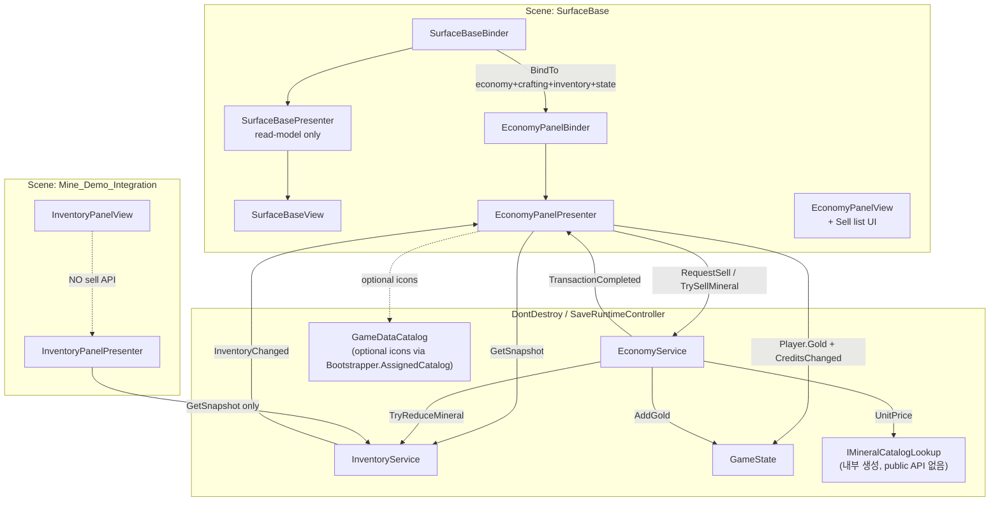
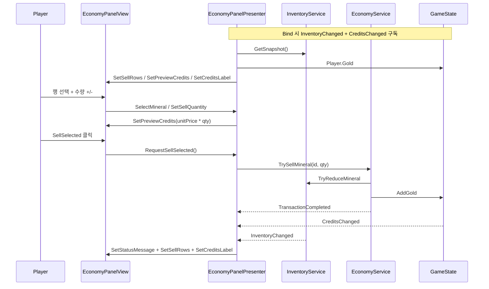
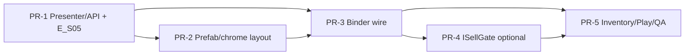

# Surface Base 광물 판매 시스템 + Sell Panel UI 설계

| 항목 | 내용 |
| --- | --- |
| **문서 제목** | Surface Base Mineral Sell System + Sell Panel UI |
| **작성** | (담당자 B / App UI·Economy) |
| **날짜** | 2026-08-08 |
| **상태** | Draft (Rev 3 — residual re-review 반영) |
| **관련 코드 소유** | `SubTerra.App` (Economy, UI/Economy, UI/SurfaceBase, Inventory 읽기) |
| **범위 씬** | `SurfaceBase.unity` only (판매 게이트) |

---

## Overview

채굴 중 인벤토리에서 광물을 즉시 골드로 바꾸면 실패·사망 시 미정산 화물 손실(PRD: 30–50%)이 무의미해지고 리스크 루프가 붕괴한다. 따라서 **광물 → 골드 정산은 Surface Base(안전 허브)에서만** 허용한다. 골드는 영구 정산 통화, 인벤토리 광물은 미정산 화물이다.

본 설계는 이미 존재하는 `EconomyService.TrySellMineral` 트랜잭션과 `EconomyPanelPresenter` / `SurfaceBaseBinder` 배선 패턴을 **재사용**하면서, 현재 상태/메시지만 있는 얇은 `EconomyPanel`을 **완전한 판매 패널 UX**로 완성한다. 인벤토리 패널(`InventoryPanel*`)에는 판매 API·버튼을 **추가하지 않는다**.

**MVP 종료 기준 (게이트)**: Surface Sell UI + Binder 배선 + 회귀 테스트가 녹색이면 충분하다. `ISellGate`는 **후속 optional**이며 MVP 필수 조건이 아니다.

---

## Background & Motivation

### 현재 상태

| 계층 | 경로 | 상태 |
| --- | --- | --- |
| 판매 트랜잭션 | `Assets/_Project/Scripts/App/Economy/EconomyService.cs` | **완성**: 카탈로그 `UnitPrice` × 수량, 사전 검증 → `TryReduceMineral` → `AddGold`, `TransactionCompleted` + `AutoSaveRequested` |
| Presenter | `.../UI/Economy/EconomyPanelPresenter.cs` | **부분**: `RequestSell(id, qty)` busy 가드만 존재. 목록·선택·수량 UI 상태 없음 |
| View 계약 | `IEconomyPanelView` | **최소**: `SetStatusMessage` / `SetStatusDetail` / `SetBusy` / `SetVisible` |
| Surface 배선 | `SurfaceBaseBinder` | **이미 연결**: `economyBinder.BindTo(runtime.Economy, runtime.Crafting)` |
| Prefab | `Prefabs/UI/SurfaceBasePanel.prefab` | EconomyPanel 자식 + EcoStatus/EcoDetail 텍스트만 (판매 컨트롤 없음) |
| Mine 인벤토리 | `UI/Inventory/*` | 화물·미정산·스택 **표시만**. Sell/TrySell 참조 **없음** (의도 유지) |
| 런타임 노출 | `SaveRuntimeController` | `InventoryService`, `Economy`, `Crafting`, `Progression` 공개. **MineralLookup / SellGate 프로퍼티 없음** (로컬 `IMineralCatalogLookup`만 생성) |
| 정적 계약 | `EconomyStaticStructureTests.E_S05` | `IEconomyPanelView` 메서드명에 `"Gold"` / `"Inventory"` / `"Spend"` 포함 금지 |

Phase L (`PhaseLMenuSceneBuilder`)과 이후 prompt-B 33.x·35.x 레이아웃 빌더는 SurfaceBase에 Economy/Progression을 붙였으나, 판매 UX는 목록·수량·확정 버튼까지 가지 못했다. 현재 chrome은 상단 상태 + Explore + (33-4) Message below Explore + 하단 Progression **760×340 @ y=−200** 이 세로 예산을 대부분 사용한다. **구안 760×420 Sell 카드는 이 예산과 산술적으로 양립 불가**하므로 Rev 2에서 전체 스택을 재측정한다.

### 고통 지점

1. **제품 루프 불완전**: 귀환 후 “판매 예상(UnsettledValue)”은 `SurfaceBaseView.SetReturnResult`에 표시되나, 실제 정산 UI가 없어 골드 확보 경로가 플레이어에게 닫혀 있다.
2. **레이아웃 부채**: SurfaceBase는 텍스트 겹침·패널 밖 overflow 수정(prompt-B 33-1~33-4, 35.x)이 반복됨. Sell을 끼워 넣으려면 **상태/액션/Progression 전체 재배치**가 필요하다.
3. **게이트 부재(문서상)**: `TrySellMineral`은 호출 가능하면 어디서든 성공한다. UI 경로상 Mine에서 호출되지 않지만, 의도적 게이트 정책이 코드/테스트에 약하다.

### 제품 결정 (확정)

- 채굴 중 인벤토리 판매 **금지**.
- 판매는 **Surface Base에서만**.
- 근거: 즉시 정산 시 실패 화물 손실이 무의미 → 게임 긴장 완화 과다.
- 골드 = 정산 완료 영구 재화 / 인벤 광물 = 미정산 화물(리스크).

---

## Goals & Non-Goals

### Goals

1. **판매 게이트**: 플레이어 대면 판매 UX와 Binder 배선은 Surface Base 컨텍스트에서만 존재. Mine 인벤토리에 판매 UI·Presenter 호출 경로를 두지 않는다.
2. **Sell Panel UX 완성**: 광물 목록(보유>0만), 보유 수량, 단가, 판매 수량 조절(기본 1), 예상 크레딧, 선택 판매 / 전체 판매, 상태 메시지, 판매 후 목록 갱신.
3. **기존 트랜잭션 재사용**: 골드 계산·인벤 차감·AutoSave는 `EconomyService.TrySellMineral` 단일 경로 유지 (`E_S02` 카탈로그 단가, 부분 적용 금지). `OutpostService.TrySettle`로 라우팅하지 않음.
4. **Binder/Presenter 패턴 준수**: View는 표시만, Presenter는 서비스 호출만, SurfaceBasePresenter는 경제 연산을 하지 않음.
5. **레이아웃 품질**: 전체 SurfaceBaseContent 자식의 비겹침 좌표표(본 문서 UI Layout Spec)를 Builder가 적용. prompt-B 33-4 Message-below-Explore 계약을 유지·확장.
6. **회귀 안전**: 인터페이스 파괴 PR에 정적 계약 테스트 동시 갱신; Inventory no-sell 가드는 후속 테스트 PR.

### Non-Goals

- 지하 전진기지 `building.settlement.basic`에서의 현장 정산 UI (데이터·`OutpostService.TrySettle` 존재와 무관하게 **본 Surface EconomyPanel 범위 밖**).
- 동적 시세·흥정·수수료·세금.
- 제작(Craft) 패널 UX 전면 개편.
- 인벤토리 패널 경제 조작.
- 네트워크 멀티플레이.
- 신규 전역 피처플래그 인프라 (`SubTerraFeatures` 등 **존재하지 않음** — 도입하지 않음).
- MVP 필수 `ISellGate` (optional 후속).

---

## Proposed Design

### 1. 아키텍처 개요



### 2. 판매 게이트 정책 (System)

#### 2.1 게이트 계층

| 계층 | 메커니즘 | MVP 필수 |
| --- | --- | --- |
| **A. UI 표면** | Sell Panel은 `SurfaceBasePanel` 하위에만. `InventoryPanel*`에 판매 없음 | **Yes** |
| **B. 배선** | `SurfaceBaseBinder.OnEnable`만 확장 `BindTo`. Mine Inventory Binder는 Economy 미바인드 | **Yes** |
| **C. `ISellGate`** | 서비스 진입 방어 | **No** (PR-4 optional) |
| **D. 정적 테스트** | Inventory no-sell; E_S05 표시 API 계약 갱신 | **Yes** (계약은 PR-1, Inventory 가드는 PR-5) |

**MVP exit**: A + B + D(관련분) + 플레이 가능 Sell UX. C는 방어 심화.

#### 2.2 권장 `ISellGate` (optional, PR-4)

```csharp
// App/Economy/ISellGate.cs
namespace SubTerra.App.Economy
{
    public interface ISellGate
    {
        /// <summary>
        /// get/set 모두 인터페이스에 둔다.
        /// Binder가 ISellGate 참조만으로 IsSellAllowed = true/false 할 수 있어야 하며,
        /// get-only면 컴파일 실패 또는 concrete cast가 강제된다.
        /// </summary>
        bool IsSellAllowed { get; set; }
        string DenyReason { get; }
    }

    public sealed class SceneSellGate : ISellGate
    {
        public bool IsSellAllowed { get; set; }
        public string DenyReason => IsSellAllowed
            ? string.Empty
            : "Surface Base에서만 판매할 수 있습니다.";
    }
}
```

| 규칙 | 내용 |
| --- | --- |
| 생성자 | `EconomyService(..., ISellGate sellGate = null)` — **null = 허용** (기존 단위 테스트 `new EconomyService(inv, catalog, state)` 무수정) |
| Deny | `!IsSellAllowed` → `InvalidRequest` + 사용자 메시지 `DenyReason` (enum 확장 없음) |
| 소유 | PR-4에서 `SaveRuntimeController`가 `SceneSellGate` 인스턴스 생성·보관, public **`ISellGate SellGate { get; }`** 노출 (기본 `IsSellAllowed = false`). UI는 concrete 타입에 의존하지 않음 |
| 토글 | `SurfaceBaseBinder.OnEnable`: `runtime.SellGate.IsSellAllowed = true`; `OnDisable`: `false` — **인터페이스 setter로 컴파일** |
| API 통일 | **`IsSellAllowed { get; set; }` 만**. `SetAllowed`/`AllowSell`/`DenySell` 헬퍼·concrete cast **없음** (인터페이스 setter가 유일한 토글 경로) |

##### 테스트 매트릭스 (gate 도입 시)

| 구성 | 기대 |
| --- | --- |
| `new EconomyService(inv, catalog, state)` (gate null) | 판매 허용 — 기존 EditMode 전부 |
| Runtime + Surface `OnEnable` 후 Presenter 판매 | 허용 |
| Runtime + gate false (Surface 미진입) 에서 `runtime.Economy.TrySellMineral` | Deny + 메시지 |
| PlayMode이 runtime Economy를 Surface 없이 판매 테스트 | gate null 로컬 서비스 구성 **또는** 테스트에서 `SellGate.IsSellAllowed = true` |

#### 2.3 Scene 이름을 서비스에 넣지 않음

`EconomyService`는 `SceneManager`를 읽지 않는다. 컨텍스트는 Binder 배선 부재(1차) 또는 주입된 `ISellGate`(2차)로만 표현한다.

### 3. 판매 UX 데이터 흐름



### 4. Presenter 확장 (핵심 로직 위치)

`EconomyPanelPresenter`에 **UI 선택 상태**를 둔다. State/Inventory **쓰기** 금지 (`E_S05` Presenter 소스 스캔: `AddGold`/`TryReduceMineral` 등 금지). **읽기**는 `GameState.Player.Gold` + `CreditsChanged` 구독으로 허용.

#### 4.1 신규 읽기 모델

```csharp
// App/UI/Economy/SellMineralRowReadModel.cs
public readonly struct SellMineralRowReadModel
{
    public string MineralId { get; }
    public string DisplayName { get; }
    public int OwnedQuantity { get; }
    public int UnitPrice { get; }       // InventoryStackEntry.UnitPrice (카탈로그 파생)
    public int LinePreviewCredits { get; }
    public bool IsSelected { get; }
    public Sprite Icon { get; }         // optional; null 허용 (MVP 아이콘 생략 가능)
}
```

##### 데이터 원천 (구체)

| 필드 | 원천 | 비고 |
| --- | --- | --- |
| 목록 행 | `InventoryService.GetSnapshot().Stacks` | **보유 수량 > 0 만** 표시 (0행 숨김) |
| `UnitPrice` | `InventoryStackEntry.UnitPrice` | 스냅샷이 이미 카탈로그 단가를 복사. **추가 MineralLookup 런타임 프로퍼티 불필요** |
| `DisplayName` | `InventoryStackEntry.DisplayName` | 동일 |
| `Icon` | optional `GameDataCatalog` via `GameBootstrapper.Instance?.AssignedCatalog` | `InventoryPanelPresenter`와 동일 패턴. 카탈로그 없거나 미전달 시 `null` (아이콘 칸 비활성). **`IMineralCatalogLookup`/`MineralUnitInfo`에 Sprite 없음** |
| 정렬 | 스냅샷 스택 순 (카탈로그 삽입 순과 실질 동일) | 깜빡임 최소 |
| 보유 골드 표시 | `GameState.Player.Gold` | `CreditsChanged`로 갱신 |

UI 입력 단가 **금지** (E_S02).

#### 4.2 Presenter API 확장

| 메서드 | 역할 |
| --- | --- |
| `Bind(EconomyService economy, CraftingService crafting = null, InventoryService inventory = null, GameState gameState = null, GameDataCatalog catalog = null)` | 기존 Bind 확장. inventory → `InventoryChanged`; gameState → `CreditsChanged` + 초기 골드; catalog → optional icons. **null inventory = 목록 skip, RequestSell만** (기존 테스트 호환) |
| `RefreshSellList()` | snapshot → **owned > 0** rows; 선택 ID가 사라지면 선택 해제 또는 첫 행 재선택 |
| `SelectMineral(string mineralId)` | 선택 하이라이트; **기본 판매 수량 = 1** (owned≥1 보장). owned가 1이면 1 |
| `SetSellQuantity(int qty)` | 클램프 `[1, owned]` (선택 중 최소 1; 선택 없으면 컨트롤 비활성) |
| `AdjustSellQuantity(int delta)` | +/- ; Max 버튼 → `owned` |
| `RequestSellSelected()` | 선택 없거나 qty&lt;1이면 **no-op** (status 유지, 서비스 미호출). 그 외 `RequestSell(selectedId, sellQty)` |
| `RequestSellAll()` | 아래 §4.3 알고리즘 |
| 기존 `RequestSell(id, qty)` | 유지 |

`IMineralCatalogLookup`를 Bind에 넣지 않는다. 가격은 스냅샷, 아이콘은 optional `GameDataCatalog`.

#### 4.3 Sell All — 확정 알고리즘

MVP: 스택별 순차 `TrySellMineral` (옵션 A). 구현 계약:

```
RequestSellAll():
  if busy → Busy 결과 표시, return
  if economy == null → DependencyMissing, return
  snapshot = inventory.GetSnapshot()  // 루프 전 1회 고정
  targets = copy of stacks where Quantity > 0
  if targets empty → empty message, return

  busy = true; view.SetBusy(true)
  // 루프 중 InventoryChanged로 인한 목록 재빌드/선택 리셋은
  // _suppressListRebuildFromInventory = true 로 억제
  // TransactionCompleted → ApplyResultToView 중간 메시지 덮어쓰기 방지:
  // _suppressStatusFromTransactions = true (루프 종료 후 집계 문자열만 표시)
  successKinds = 0; successQty = 0; goldTotal = 0; attempted = targets.Count
  lastFailDetail = ""
  for each stack in targets:
    // 중첩 RequestSell 금지 — busy 재진입 차단을 피하기 위해
    // economy.TrySellMineral 직접 호출 (Presenter busy는 이미 true)
    result = economy.TrySellMineral(stack.MineralId, stack.Quantity)
    if result.IsSuccess:
      successKinds++
      successQty += result.ChangedQuantity
      goldTotal += result.GoldDelta
    else:
      lastFailDetail = result.Diagnostic
    // 실패 시 다음 스택 계속 (부분 성공 유지)
  busy = false; view.SetBusy(false)
  _suppressListRebuildFromInventory = false
  _suppressStatusFromTransactions = false
  RefreshSellList()  // 1회
  RefreshCreditsLabel()
  if successKinds == 0:
    SetStatusMessage("판매할 수 없습니다.")
    SetStatusDetail(lastFailDetail)
  else if successKinds < attempted:
    SetStatusMessage($"부분 판매: {successKinds}/{attempted} 성공 · +{goldTotal}G")
    SetStatusDetail(string.Empty)
  else:
    SetStatusMessage($"{successKinds}종 판매 · +{goldTotal}G")
  // AutoSave: 성공 건당 기존대로 N회 AutoSaveRequested — MVP 허용
```

| 항목 | 계약 |
| --- | --- |
| busy 스팬 | **전체 루프 1회** |
| 중첩 | `RequestSell` 재진입 아님 → 서비스 직접 호출 |
| 부분 성공 | 이미 커밋된 스택 유지 (롤백 없음) |
| InventoryChanged mid-loop | 목록 리빌드 억제, 종료 후 1회 refresh |
| 선택 상태 | 종료 후 refresh; 이전 선택 ID 없으면 클리어 |
| 확인 모달 | 없음. 버튼 라벨에 총 예상 크레딧 |

#### 4.4 미리보기 크레딧 계산

- `EconomyPricing.TryComputeGoldGain(unitPrice, qty, out gain, out diag)` static helper를 `App/Economy`에 추출해 Service 사설 메서드와 **동일 규칙** 공유 (optional PR-1 파일; 미추출 시 Presenter가 동일 오버플로 검사 복제).
- Preview는 State 불변.
- View API 이름은 `SetPreviewCredits` (아래 §5) — `"Gold"` 문자열로 E_S05를 깨지 않음.

### 5. View 계약 확장

**E_S05 계약 정리**: 기존 테스트는 View 메서드명에 `"Gold"`/`"Inventory"`/`"Spend"`를 금한다. 의도는 **mutation 표면 금지**이다. 표시용 API는 다음 이름을 쓴다.

```csharp
namespace SubTerra.App.UI.Economy
{
    public interface IEconomyPanelView
    {
        // 기존
        void SetStatusMessage(string message);
        void SetStatusDetail(string detail);
        void SetBusy(bool busy);
        void SetVisible(bool visible);

        // 신규 — 판매 목록 (표시 전용; mutation 없음)
        void SetSellRows(IReadOnlyList<SellMineralRowReadModel> rows);
        void SetSelectedMineral(string mineralId, int sellQuantity, int owned, int unitPrice);
        void SetSellQuantityControls(int sellQuantity, int min, int max);
        void SetPreviewCredits(int previewCredits, string previewLabel);
        void SetCreditsLabel(int credits);   // 보유 골드 표시. 이름에 "Gold" 없음 → E_S05 통과
        void SetSellActionsEnabled(bool sellSelected, bool sellAll);
        void SetEmptySellState(bool isEmpty, string emptyMessage);
    }
}
```

**PR-1에서 `E_S05` 갱신 내용**:

1. Presenter 소스 스캔 유지: `AddGold`/`SetGold`/`TryReduceMineral`/`TryAddMineral`/`SetQuantity` 금지, `TrySellMineral` 허용.
2. View 메서드명: `"Gold"` / `"Inventory"` / `"Spend"` 금지 **유지** → 설계가 `SetPreviewCredits` / `SetCreditsLabel`을 쓰는 이유.
3. (선택 주석) 표시용 `Credits` 접두/접미 허용을 테스트 주석에 명시.

View 구현 원칙:

- MonoBehaviour = TMP/Button 참조만.
- 클릭 → Presenter 위임.
- `SetBusy(true)` 시 수량·Sell·행 선택 비활성.

### 6. UI 구조 (SurfaceBase 내)

Content **1078×990** (center). Sell은 **모달 오버레이가 아니라** 인라인 카드. **Progression levels-only 유지하되 높이를 축소·하향**해 Sell 예산을 확보한다 (UI Layout Spec 권위 좌표표).

```text
SurfaceBasePanel
└─ SurfaceBaseContent (1078×990, center)
   ├─ Goals / Energy / DeepZone / RecentRun     (상태 밴드, 상단 압축)
   ├─ Explore + Settings + Quit                  (액션 행)
   ├─ MessageText                                (액션 행 아래 — 33-4 계약 유지)
   ├─ EconomyPanel  ← Sell 카드 (root rect 비-stretch)
   │  ├─ Header: "광물 판매" + CreditsLabel
   │  ├─ SellListViewport (ScrollRect + RectMask2D)
   │  │  └─ SellListContent → SellRow[i]
   │  ├─ QtyRow: [-] Qty [+] [최대]
   │  ├─ PreviewText
   │  ├─ Actions: [선택 판매] [전체 판매]
   │  └─ EcoStatus / EcoDetail
   └─ ProgressionPanel (levels-only, 축소 높이)
```

#### SellRow Prefab

`Assets/_Project/Prefabs/UI/EconomySellRow.prefab` + `EconomySellRowView`.

| 필드 | 타입 | 비고 |
| --- | --- | --- |
| mineralId | string | |
| iconImage | Image | optional; sprite null 시 disabled |
| nameText | TMP | Ellipsis |
| ownedText | TMP | `보유 {n}` |
| unitPriceText | TMP | `{price}G` |
| selectButton | Button | |
| selectedChrome | Graphic | |

행 높이 **고정 40px** (260px 카드 안 2행 가시 + 스크롤; 3광물 시 1행 스크롤).

### 7. SurfaceBaseBinder 통합

현 코드:

```csharp
economyBinder.BindTo(runtime.Economy, runtime.Crafting);
```

**PR-3 배선 (실존 API만)**:

```csharp
// SaveRuntimeController 현재 public: InventoryService, Economy, Crafting, Progression
// GameState: GameBootstrapper.Instance.State
// Catalog(icons): GameBootstrapper.Instance?.AssignedCatalog as GameDataCatalog

if (economyBinder != null && runtime.Economy != null)
{
    var state = GameBootstrapper.Instance != null
        ? GameBootstrapper.Instance.State
        : null;
    var catalog = GameBootstrapper.Instance != null
        ? GameBootstrapper.Instance.AssignedCatalog as GameDataCatalog
        : null;

    economyBinder.BindTo(
        runtime.Economy,
        runtime.Crafting,
        runtime.InventoryService,
        state,
        catalog);
}

// PR-4 이후만:
// if (runtime.SellGate != null) runtime.SellGate.IsSellAllowed = true;

// OnDisable:
// if (runtime.SellGate != null) runtime.SellGate.IsSellAllowed = false;
economyBinder?.Unbind();
```

- **존재하지 않는** `runtime.MineralLookup` / `runtime.SellGate.SetAllowed` **사용 금지**.
- Sell list: Economy Presenter가 `InventoryChanged` 자체 구독.
- 판매 후 Surface 귀환 요약: 기존 `OnInventoryChangedForProgression`에 `presenter?.RefreshReadModel()` 한 줄 추가 가능 (Progression refresh 옆).
- SurfaceBasePresenter **경제 연산 없음** 유지.

### 8. Mine 인벤토리 무판매 보장

| 검사 | 방법 |
| --- | --- |
| 소스 정적 | Inventory UI에 `TrySell`/`RequestSell`/`EconomyService` 없음 (PR-5) |
| Prefab | Sell 버튼 없음 |
| 런타임 | Inventory Presenter에 sell 메서드 없음 |

### 9. 에디터 빌더

- 전용 `PromptB_SellPanelLayoutBuilder` (권장).
- **베이스라인**: 최신 Surface 수정 체인 **`PromptB33_4` / `PromptB35_2`** 결과를 전제로 하고, PhaseL 원본만 단독 적용하지 않음.
- Builder 책임 범위 (**PR-2 필수**):
  1. SurfaceBaseContent **모든 주요 자식** y-range 재배치 (Goals…RecentRun, Explore/Settings/Quit, Message, EconomyPanel **root rect**, Progression root)
  2. EconomyPanel 내부 Sell 컨트롤 생성·LayoutGroup
  3. Progression **root** 760×220 @ −250 **및** 내부 `UpgradeList` **700×180** (또는 ≤200)으로 재배치 — 33-3의 UpgradeList h=240을 **덮어씀**. 탭/구매/엔트리/Detail 숨김 유지
  4. EconomyPanel을 full-stretch에서 **고정 sizeDelta 카드**로 변경 (현 stretch+중앙 EcoStatus 패턴 폐기)
  5. EditMode/빌더 후 assert: UpgradeList bounds ⊆ Progression bounds (padding ≥ 8)
- 좌표 상수 = Layout Spec 권위 표. 수동 Prefab 드리프트 시 메뉴로 재적용.

### 10. 로컬라이제이션

| 키 | KO 기본 |
| --- | --- |
| `economy.sell.title` | 광물 판매 |
| `economy.sell.owned` | 보유 {0} |
| `economy.sell.unit_price` | 단가 {0}G |
| `economy.sell.preview` | 예상 골드 +{0} |
| `economy.sell.selected` | 선택 판매 |
| `economy.sell.all` | 전체 판매 · +{0}G |
| `economy.sell.empty` | 판매할 광물이 없습니다. 탐사 후 귀환하세요. |
| `economy.sell.denied` | Surface Base에서만 판매할 수 있습니다. |
| `economy.sell.qty_max` | 최대 |
| `economy.sell.partial` | 부분 판매: {0}/{1} 성공 · +{2}G |
| `economy.sell.all_ok` | {0}종 판매 · +{1}G |
| `economy.sell.credits` | 골드 {0} |

`LocalizationService.Add(key, ko, en)` 패턴 (기존 설정 키와 동일).

---

## API / Interface Changes

### 변경 요약

| API | Before | After |
| --- | --- | --- |
| `EconomyService.TrySellMineral` | 항상 검증 후 판매 | PR-4: optional `ISellGate` (Deny 시 fail). MVP에선 무변경 가능 |
| `EconomyPanelPresenter.Bind` | economy + crafting | + `InventoryService?` + `GameState?` + `GameDataCatalog?` |
| `IEconomyPanelView` | 4 methods | + sell list / `SetPreviewCredits` / `SetCreditsLabel` / actions |
| `EconomyPanelBinder.BindTo` | 2 args | overload with inventory + state + catalog |
| `SurfaceBaseBinder` | economy+crafting | inventory+state+catalog 전달; PR-4 시 gate 토글 |
| `SaveRuntimeController` | — | PR-4만: `ISellGate SellGate` 프로퍼티 추가 |
| Inventory UI | — | **변경 없음** |

### 호환성

- inventory/state null Bind → 목록·크레딧 라벨 skip, `RequestSell`만 (기존 테스트).
- Fake views: 신규 메서드 empty stub — **PR-1에 포함**.
- `E_S05` 및 관련 정적 테스트 — **PR-1에 포함** (PR-5로 미루지 않음).

---

## Data Model Changes

### 런타임 상태

| 데이터 | 저장? | 설명 |
| --- | --- | --- |
| 선택 광물 ID / 판매 수량 | 세션 UI only | Presenter 필드 |
| Gold / stacks | 기존 | 변경 없음 |
| MineralData.unitPrice | SO | 변경 없음 |

### 스키마 / 마이그레이션

- 세이브 포맷 변경 없음. 신규 SO 없음 (행 Prefab만).

### 광물 카탈로그 (예시 가격 — UI 하드코딩 금지)

| ID | Display (에셋) | UnitPrice (에셋 예시) |
| --- | --- | --- |
| `mineral.copper` | Copper | **10** |
| `mineral.iron` | Iron | **15** |
| `mineral.lithium` | Lithium | **40** |

예: Copper×3 + Iron×2 + Lithium×1 → 30+30+40 = **100G** (문서·QA 검산용).  
**테스트는 에셋 가격에 의존하지 말고** 기존처럼 `InMemoryMineralCatalog.Register(...)`로 단가를 주입한다 (`EconomyServiceTests` 패턴).

목록: **owned > 0** 스택만, 스냅샷 순.

---

## Alternatives Considered

### Alternative 1 — Inventory 패널에 Sell (기각)

제품 리스크 루프 파괴. **기각**.

### Alternative 2 — 신규 SettlementService (기각 현재)

`TrySellMineral` 중복. 지하 정산 착수 시 façade로 재검토.

### Alternative 3 — UI-only 게이트 (MVP 채택)

서비스 무변경. **MVP exit**. `ISellGate`는 PR-4 optional.

### Alternative 4 — Sell All 일괄 원자 API (연기)

MVP는 순차 단건.

### Alternative 5 — Sell 모달 오버레이 (기각)

인라인 카드 + chrome 재배치로 세로 예산 확보. 모달은 설정 패널과 z-order 경쟁·포커스 이슈.

### Alternative 6 — 760×420 Sell 유지 + Progression 제거 (기각)

levels 요약은 Surface 정보 밀도에 유용. **Progression 축소**가 균형.

---

## Security & Privacy Considerations

| 위협 | 심각도 | 완화 |
| --- | --- | --- |
| UI 단가 조작 | Medium | 카탈로그/`InventoryStackEntry.UnitPrice`만 (`E_S02`) |
| 음수/거대 수량 | Medium | 서비스 검증 + 오버플로 사전 검사 |
| Mine 판매 | High | UI 미배치 + 정적 테스트 (+ optional gate) |
| 중복 클릭 | Low | busy (단건·SellAll 전체 스팬) |
| 부분 차감 불일치 | High | 단건 원자 커밋 유지 |
| 로그 덤프 | Low | 짧은 Diagnostic |

Privacy: 로컬 싱글 플레이.

---

## Observability

| 신호 | 구현 |
| --- | --- |
| 거부 | `Debug.LogWarning` (gate deny 포함, PR-4) |
| 성공 | `TransactionCompleted` + `AutoSaveRequested` (SellAll 시 N회) |
| UI | EcoStatus / EcoDetail; 부분 판매 고정 포맷 문자열 |
| QA | Surface sell / Mine no sell 체크 |

---

## Rollout Plan

본 섹션은 **PR Plan과 동일한 5-PR 그래프**를 따른다. 별도 4-step 번호는 사용하지 않는다.

| 단계 | 내용 | 롤백 |
| --- | --- | --- |
| **PR-1** | View 계약 + Presenter 목록/선택/크레딧 바인딩 (헤드리스) + **E_S05·fake 갱신** | 커밋 revert |
| **PR-2** | Prefab + **전체 Surface chrome 좌표** Layout Builder (배선 없음) | Builder로 이전 좌표 재적용 또는 prefab revert |
| **PR-3** | `SurfaceBaseBinder` / `EconomyPanelBinder` 런타임 배선 (플레이 가능 슬라이스) | Binder를 2-arg `BindTo`만 호출 + Sell 자식 `SetActive(false)` |
| **PR-4** | optional `ISellGate` | gate null 주입으로 무력화 |
| **PR-5** | Inventory no-sell 정적 가드, PlayMode Surface, QA 문서 | 테스트-only |

**피처플래그 클래스 도입 없음.** 롤백은 Prefab `activeSelf` / Binder overload 미사용.

---

## Open Questions

(제품·타이밍만 남김. 수량/숨김/레이아웃/골드는 Key Decisions로 승격.)

1. **Sell All 확인 모달** — MVP 없음. 추후 필요 시 설정?
2. **Craft UI**를 Sell과 탭으로 묶을 시점 — Sell 안정화 후.
3. 판매 성공 후 `RecentRun` “판매 예상” 문구 — PR-3에서 `RefreshReadModel` 호출 권장, 필수 여부는 구현 시 확인.

---

## Key Decisions

| # | 결정 | 근거 |
| --- | --- | --- |
| K1 | 판매는 Surface Base 전용, Mine 인벤 판매 없음 | 미정산 화물 리스크 (제품) |
| K2 | `TrySellMineral` 단일 커밋 경로; Outpost settle 미사용 | Phase E 계약 |
| K3 | UI 상태 Presenter / 표시 View / 쓰기 금지 | E_S05 + 패턴 |
| K4 | SurfaceBasePresenter 경제 연산 없음 | 중복 트랜잭션 방지 |
| K5 | 1차 게이트 = UI/배선; `ISellGate`는 **MVP 비필수** optional | 제품 exit = UI+wire+tests |
| K6 | Sell All = 순차 단건 + §4.3 메시지/busy 계약 | API 최소 확장 |
| K7 | 단가 = 스냅샷 UnitPrice; UI 단가 없음 | E_S02 |
| K8 | 레이아웃 = 고정 행 + ScrollRect + 전체 chrome 재배치 | prompt-B 재발 방지 |
| K9 | 지하 settlement UI OOS | 범위 통제 |
| K10 | KO 카피 + LocalizationService 키 | 팀 관례 |
| **K11** | **Sell 카드 760×260 @ y=+55; Progression 760×220 @ y=−250; 상태/액션/Message 압축 재배치** (권위 표 §Layout). 구 760×420 폐기 | 990 세로 예산 산술 정합 |
| **K12** | **보유 크레딧 = `GameState.Player.Gold` + `CreditsChanged` 구독**. Bind에 GameState 전달 | 스냅샷에 gold 없음 |
| **K13** | **0 보유 행 숨김; `SelectMineral` 기본 qty = 1; Max → owned** | 구현 분기 제거 |
| **K14** | **View 표시 API = `SetPreviewCredits` / `SetCreditsLabel`** (`Gold` 메서드명 금지로 E_S05 유지) | CI 계약 |
| **K15** | **아이콘 optional (`GameDataCatalog`); 가격에 MineralLookup 런타임 프로퍼티 불필요** | 실존 API만 사용 |

---

## UI Layout Spec (Anti-Overlap / Anti-Overflow)

> 실패 모드: (1) 텍스트 겹침 (2) 과밀 (3) bounds overflow (4) busy 메시지·버튼 중첩.  
> **모든 좌표는 Content 로컬, anchorMin=Max=(0.5,0.5), pivot=(0.5,0.5)** 기준.  
> Content sizeDelta = **(1078, 990)** → 이론적 가시 대략 y ∈ [−495, +495].

### 1. 해상도·Safe Area

| 항목 | 값 |
| --- | --- |
| 레퍼런스 | 1920×1080 |
| 최소 | 1280×720 |
| Canvas Scaler | Scale With Screen Size, match 0.5 |
| Safe Area | 기존 root; 패널 안쪽 ≥4% |

### 2. 권위 좌표표 (PR-2 Builder 상수 — 단일 출처)

`yMin = anchoredPosition.y − sizeDelta.y/2`, `yMax = y + h/2`.  
**인접 밴드 gap = 위쪽 yMin − 아래쪽 yMax ≥ 명기값.**

| 요소 | anchoredPosition | sizeDelta (w×h) | yMin | yMax | 비고 |
| --- | --- | --- | --- | --- | --- |
| GoalsText | (0, **430**) | 720×36 | 412 | 448 | 상태 |
| EnergyText | (0, **388**) | 720×32 | 372 | 404 | gap↑ 8 |
| DeepZoneText | (0, **352**) | 720×28 | 338 | 366 | gap↑ 6 |
| RecentRunText | (0, **320**) | 720×28 | 306 | 334 | gap↑ 4 |
| ExploreButton | (−200, **272**) | 320×48 | 248 | 296 | 액션 행 |
| SettingsButton | (40, **272**) | 140×48 | 248 | 296 | |
| QuitButton | (190, **272**) | 140×48 | 248 | 296 | |
| MessageText | (0, **218**) | 720×32 | 202 | 234 | **Explore 아래** (33-4 정신) |
| **EconomyPanel** | (0, **+55**) | **760×260** | **−75** | **+185** | gap Message→Sell: 202−185=**17** ≥ 16 |
| **ProgressionPanel** | (0, **−250**) | **760×220** | **−360** | **−140** | gap Sell→Prog: −75−(−140)=**65** ≥ 20 |
| **UpgradeList** (Progression 자식) | local (0, **0**) 권장 | **700×180** | 패널 로컬 기준 content 안 | | levels-only 단일 TMP; **루트 h=220 안에 완전 포함** |

##### Progression 내부 (levels-only, PR-2 필수)

33-3 `ApplySurfaceBaseLevelsOnly`는 `UpgradeList`를 **height 240**으로 둔다. 루트를 220으로 줄인 뒤 내부를 그대로 두면 TMP가 카드 밖으로 넘친다. PR-2 Builder는 루트 이동과 **동시에** 내부를 맞춘다.

| 요소 | parent | anchoredPosition (parent-local) | sizeDelta | 비고 |
| --- | --- | --- | --- | --- |
| ProgressionPanel | SurfaceBaseContent | (0, −250) | 760×220 | 권위 표 위 행 |
| UpgradeList | ProgressionPanel | (0, **0**) 또는 (0, **+4**) top 약간 | **700×180** | `PlaceCentered` 대체 값 |
| CategoryTabBar / Purchase / entry buttons | ProgressionPanel | — | — | **비활성 유지** (33-3 levels-only) |
| UpgradeDetail / UpgradeResult / ProgDeep | ProgressionPanel | — | — | **비활성 유지** |

| TMP (UpgradeList) | 값 |
| --- | --- |
| fontSize | **≤ 18** (권장 16–17 if 7줄 밀도) |
| textWrappingMode | **Normal** |
| overflow | Overflow 금지 시 Truncate/Ellipsis 대신 wrap + 패널 clip; 가능하면 parent RectMask2D |
| alignment | TopLeft (기존 levels-only) |
| 내용 | `WriteLevelsOnlySummary` 7종 장비 레벨 한 블록 — 스크롤 없이 180px 안에 들어가게 줄간격 유지 |

**포함 검증 (Progression child ⊆ root):**

```
// parent-local: UpgradeList fully inside Progression content box
// padding ≥ 8 each side on 760×220 → usable ≈ 744×204
assert UpgradeList.sizeDelta.x <= 744
assert UpgradeList.sizeDelta.y <= 200   // 180 preferred; hard max 200
assert abs(UpgradeList.anchoredPosition.y) + UpgradeList.sizeDelta.y/2
      <= Progression.sizeDelta.y/2 - 8
```

#### 검증 산술 (구현·EditMode smoke)

```
assert Message.yMin - Economy.yMax >= 16   // 202 - 185 = 17
assert Economy.yMin - Progression.yMax >= 20 // -75 - (-140) = 65
assert no pair of listed rects has overlapping [yMin,yMax] except intentional same-row buttons
assert Economy.sizeDelta == (760, 260)
assert Progression.sizeDelta == (760, 220)
assert UpgradeList.sizeDelta.y <= 200 && UpgradeList.sizeDelta.y >= 160
assert UpgradeList fully inside Progression rect (padding ≥ 8)
```

#### ASCII (center y, 라벨은 **edge**가 아니라 **center line** 아님 — edge 표기)

```text
yMax content ≈ +495
  Goals     [412 .. 448]
  Energy    [372 .. 404]
  DeepZone  [338 .. 366]
  Recent    [306 .. 334]
  Actions   [248 .. 296]   Explore | Settings | Quit
  Message   [202 .. 234]
  ── gap 17px ──
  Economy   [-75 .. +185]  center y=+55, h=260   ← Sell card
  ── gap 65px ──
  Progress  [-360 .. -140] center y=-250, h=220  ← levels-only
yMin content ≈ -495
```

**이전 오류 (폐기)**: 760×420 @ y≈+40~80 및 “top=+60 / bottom=−150” 다이어그램 — center/edge 혼동 및 Progression 760×340 @ −200 과 충돌.

### 3. EconomyPanel 내부 (h=260 예산)

| 구역 | 높이 | 누적 규칙 |
| --- | --- | --- |
| Padding T/B | 8+8 | LayoutGroup |
| Header | 28 | 타이틀 + credits |
| spacing | 6 | |
| List viewport | **100** | 행 40×2 + 내부 spacing; Scroll+Mask |
| spacing | 6 | |
| Qty row | 32 | ±/+/최대 28px 타깃 |
| spacing | 6 | |
| Preview | 22 | 한 줄 Ellipsis |
| spacing | 6 | |
| Actions | 36 | 버튼 h 32–36 |
| spacing | 6 | |
| EcoStatus (+Detail 실패 시 교체/2줄 max) | 28 | |
| **합계** | **8+8+28+6+100+6+32+6+22+6+36+6+28 = 292** | |

292 > 260이므로 **최종 내부 트림** (Builder 강제):

| 구역 | 확정 높이 |
| --- | --- |
| Padding T/B | 6+6 |
| Header | 26 |
| List viewport | **88** (행 40 + spacing 4 → 약 2행, 3번째는 스크롤) |
| Qty | 30 |
| Preview | 20 |
| Actions | 34 |
| Status | 24 |
| spacings (5×5) | 25 |
| **합계** | **6+6+26+88+30+20+34+24+25 = 259** ≈ 260 |

내부 padding L/R **12**. 자식 spacing **≥ 5**.

#### 3.1 Header

- 좌 타이틀 / 우 `골드 {n}` (`SetCreditsLabel`).
- HorizontalLayoutGroup spacing **10**.
- TMP NoWrap + Ellipsis.

#### 3.2 Sell List

| 항목 | 값 |
| --- | --- |
| Viewport h | **88** 고정 |
| 행 h | **40** (LayoutElement) |
| 열 | Icon 32×32 (optional) \| Name flex \| Owned 64 \| Price 64; 간격 6 |
| Mask | RectMask2D 필수 |
| ContentSizeFitter | Content only vertical preferred; Viewport에 fitter 금지 |

#### 3.3 Qty / Preview / Actions / Status

- Qty 컨트롤 min touch **28×28**, 간격 ≥ 6.
- Preview 한 줄.
- Actions: min width 150, 버튼 간격 ≥ 10, disabled 시 알파 0.45·자리 유지.
- Status max 2 lines; busy 시 버튼과 기하 중첩 금지 (33-4).

### 4. TMP 공통

| 속성 | 값 |
| --- | --- |
| wrap | 상태 Normal; 행/버튼 NoWrap+Ellipsis |
| raycastTarget | 라벨 false |
| font | 행 15–17, 헤더 18–20, 버튼 16–18 |
| extraPadding | true |

### 5. 겹침 QA 체크리스트

1. 1920×1080 / 1280×720에서 권위 표 gap 유지.
2. 0 / 1 / 3 스택, 긴 EN 이름 → Ellipsis, 열 비겹침.
3. 큰 preview 숫자 → 카드 밖 유출 없음.
4. Sell / SellAll busy 연타 → 레이아웃 점프 없음.
5. Economy [yMin,yMax] ∩ Progression [yMin,yMax] = ∅.
6. Message ∩ Explore = ∅; Message ∩ Economy = ∅.
7. Settings 모달 오픈 시 전체 커버 정상.

### 6. LayoutGroup / Fitter

- 부모·자식 양축 LayoutGroup+Fitter 순환 금지.
- EconomyPanel root: **고정 sizeDelta**, stretch 금지 (현 PhaseL Stretch 제거).
- SurfaceBaseContent 자식 좌표는 Builder 표 단일 출처.

### 7. KO/EN

- 버튼 min width 150; 텍스트 scale-down 금지.
- empty/partial 문구 Status 2줄 wrap.

### 8. 입력

- MVP 마우스/터치; 타깃 ≥ 28×28 (행 40 충족).

### 9. Builder 체인 요구 (Issue 7)

PR-2 Builder는 **Sell 내부만이 아니라** §2 표 전 행을 쓴다. 적용 전 권장 순서:

1. 기존 최신 Surface 레이아웃 메뉴 적용 상태 확인 (`PromptB33_4` / `PromptB35_2`)
2. `PromptB_SellPanelLayoutBuilder`가 chrome+Sell+Progression 일괄 기록
3. (선택) EditMode: y-interval non-overlap assert

---

## Risks

| 위험 | 심각도 | 완화 |
| --- | --- | --- |
| Surface 재겹침 | High | 권위 좌표표 + Builder 전체 chrome + smoke assert |
| 내부 260 예산 초과 | Medium | §3 확정 내부 높이 합 259; 행 40px |
| SellAll 다중 AutoSave | Low | MVP 허용 |
| IEconomyPanelView / E_S05 | Medium | 이름 규칙 K14 + PR-1 동시 수정 |
| 허구 runtime API | Medium | K15 — InventoryService + GameState + optional catalog만 |
| ISellGate 기본 deny + 테스트 | Low | null gate = allow; 매트릭스 §2.2 |
| Preview/실거래 불일치 | Medium | EconomyPricing 공유 |

---

## Testing Strategy

### Edit Mode

1. 기존 `EconomyServiceTests` 유지.
2. Presenter: 목록(owned>0), 기본 qty 1, preview, Select, SellSelected; GameState 골드 라벨 + CreditsChanged.
3. **PR-1 필수**: `EconomyStaticStructureTests.E_S05` — View에 `Gold` 메서드명 없음 확인 + 새 Credits API 존재; fakes stub.
4. PR-4: gate deny; null gate allow.
5. PR-5: Inventory UI 소스 `TrySellMineral`/`RequestSell` 없음.
6. (선택) Layout y-interval smoke.

### Play Mode

1. SurfaceBase → 목록 → 판매 → Credits/Inventory 일치.
2. Mine 인벤 → 판매 UI 없음.
3. busy 연타; SellAll 부분 메시지 포맷.
4. UnsettledValue↓ Gold↑ AutoSave.

### 수동 QA

- `docs/MVP2_WINDOWS_QA.md`: Surface sell / no mine sell.
- 권위 표 gap 육안 (1920 및 1280).

---

## References

- `init/PRD.md` — 미정산 손실 30–50%
- `init/structure.md` — SurfaceBase 판매·제작·업그레이드·탐사
- `work_process/MVP/MVP-B/E/implementation.md`
- 코드:
  - `EconomyService.cs`, `UI/Economy/*`, `SurfaceBaseBinder.cs`, `UI/Inventory/*`
  - `SaveRuntimeController.cs` (공개: InventoryService, Economy, Crafting, Progression)
  - `GameState.CreditsChanged` / `Player.Gold`
  - `PhaseLMenuSceneBuilder`, `PromptB33_*`, `PromptB35_*`
  - Minerals: Copper 10 / Iron 15 / Lithium 40
  - `EconomyStaticStructureTests.E_S05`

---

## Future (Out of Scope)

- `building.settlement.basic` 지하 정산 UI; `OutpostService.TrySettle` 통합 리팩터
- 시세·상인·수수료; 원자 `TrySellAll`; Craft 탭 통합

---

## PR Plan

각 PR은 머지 후 기존 Economy 테스트 녹색. **Rollout과 동일 순서.**

### PR-1: Sell Presenter 모델 + View 계약 (헤드리스)

- **제목**: `feat(economy-ui): sell list presenter state and IEconomyPanelView extension`
- **영향**:
  - `IEconomyPanelView.cs`, `EconomyPanelPresenter.cs`, `SellMineralRowReadModel.cs`
  - `EconomyPricing.cs` (optional)
  - `EconomyPanelView.cs` — 신규 API no-op/partial
  - **Tests (필수 동봉)**: `EconomyStaticStructureTests` (E_S05 계약 유지·주석), `CraftingOrchestrationTests` fake, `EconomyPlayModeTests` PlayView stub
  - 신규 Presenter EditMode (list/qty/preview/credits bind)
- **의존성**: 없음
- **요약**: Inventory 스냅샷 행, GameState 크레딧 읽기, 기본 qty 1, 0행 숨김, SellAll 알고리즘 단위 테스트. Prefab 변경 없음.

### PR-2: Sell Prefab + **전체 Surface chrome** 레이아웃

- **제목**: `feat(economy-ui): SurfaceBase sell panel layout and chrome reflow`
- **영향**:
  - `Prefabs/UI/EconomySellRow.prefab`, `SurfaceBasePanel.prefab`, `SurfaceBase.unity`
  - `EconomySellRowView.cs`, `EconomyPanelView.cs` 실바인딩
  - `PromptB_SellPanelLayoutBuilder.cs` — **§2 권위 표 전 행 + Sell 내부 + Progression 760×220@−250 + UpgradeList 700×180 (h≤200, ⊆ root)**
  - 33-4/35-2 이후 체인에서 실행; 33-3 UpgradeList h=240 **덮어쓰기**
- **의존성**: PR-1
- **요약**: 비겹침 레이아웃만. **런타임 Binder 배선 없음** (시각 리뷰 독립). Progression 내부 overflow 제거.

### PR-3: SurfaceBaseBinder 배선

- **제목**: `feat(economy-ui): wire sell panel inventory and GameState on SurfaceBase`
- **영향**:
  - `EconomyPanelBinder.cs` overload
  - `SurfaceBaseBinder.cs` — `InventoryService` + `GameState` + optional catalog; `RefreshReadModel` on inventory change
  - Localization 키
- **의존성**: PR-1, PR-2
- **요약**: 플레이 가능 수직 슬라이스.

### PR-4: (optional) ISellGate

- **제목**: `feat(economy): optional ISellGate for surface-only sell`
- **영향**:
  - `ISellGate.cs`, `SceneSellGate.cs`
  - `EconomyService` optional gate
  - `SaveRuntimeController.SellGate` 프로퍼티 타입 **`ISellGate`** (기본 `IsSellAllowed=false`)
  - `ISellGate.IsSellAllowed` **`{ get; set; }`** — Binder 대입이 인터페이스만으로 컴파일
  - `SurfaceBaseBinder`: `SellGate.IsSellAllowed = true/false` (concrete cast / SetAllowed 없음)
  - `EconomyServiceTests` + §2.2 매트릭스
- **의존성**: PR-3 권장
- **요약**: MVP 비필수. null gate = 기존 allow.

### PR-5: Inventory no-sell 가드 + PlayMode/QA

- **제목**: `test(economy): inventory no-sell guards and surface sell playmode`
- **영향**:
  - Inventory no-sell structure tests
  - PlayMode Surface 시나리오
  - `docs/MVP2_WINDOWS_QA.md`
  - (선택) layout non-overlap smoke
- **의존성**: PR-3 (PR-4 있으면 gate 시나리오 포함)
- **요약**: **인터페이스 계약 테스트는 여기 두지 않음** (PR-1 책임). 본 PR은 Inventory/Play/QA.

### PR 의존 그래프



---

*문서 끝 — Rev 3. 구현은 PR-1부터.*
