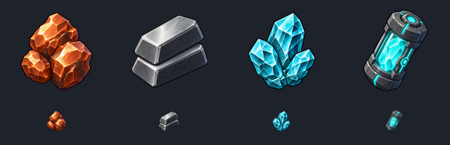

# 인벤토리 품목 아이콘 교체

구리·철·리튬의 회색박스 아이콘을 개별 품목 아트로 교체하고, 엔진 연료에는 기존에 제작한 청록 결정 캡슐을 적용했다. 광맥 타일과 획득 아이템이 인벤토리에서 구별되도록 하는 아트 작업이다.

## 적용 파일

- `Assets/_Project/Art/Icons/icon_copper.png`: 주황빛 구리 덩어리.
- `Assets/_Project/Art/Icons/icon_iron.png`: 은회색 철 주괴.
- `Assets/_Project/Art/Icons/icon_lithium.png`: 기존 리튬 타일과 맞춘 시안·청록 결정.
- `Assets/_Project/Art/Icons/icon_engine_fuel.png`: 청록 결정이 들어 있는 연료 캡슐.
- 각 PNG의 `.meta`와 `Data/Minerals/Mineral_Copper.asset`, `Mineral_Iron.asset`, `Mineral_Lithium.asset`의 `icon` 참조.

모든 게임용 파일은 개별 256×256 RGBA PNG다. Single Sprite, PPU 256, 최대 크기 256, Bilinear, Clamp, 무압축, 밉맵 없음으로 임포트했다. 엔진 연료의 기존 GUID는 유지했다. 연료 메타에 있었던 Int64 범위를 벗어난 불필요한 스프라이트 매핑도 제거하여 정상 Single Sprite 참조를 유지한다.

품목 ID, 무게, 판매가, 채굴·판매·저장 로직과 씬·프리팹은 변경하지 않는다. `InventoryPanelPresenter`가 카탈로그의 `Icon`을 읽고 `InventoryStackRowView`의 Image에 전달하는 기존 연결을 사용한다.

## 최소 검증 결과

- 네 PNG 모두 256×256, 알파 채널 있음, 네 모서리 알파 0 확인.
- Unity에서 네 Sprite 임포트와 품목 카탈로그 참조 확인.
- Preview Scene에 실제 `InventoryPanel.prefab`을 임시 생성하여 네 품목을 표시: 4/4 Image가 카탈로그의 올바른 Sprite를 받으며 enabled 및 preserveAspect 확인. 임시 인스턴스와 Preview Scene은 종료했다.
- 128px와 실제 슬롯 크기 34px 미리보기 시각 검수 완료.
- 검증 직후 Unity Console Error 조회: 0건.
- 이번 변경에 새 테스트 코드를 추가하거나 전체 테스트·Windows 빌드를 실행하지 않았다. Bootstrap에서의 실제 플레이와 재접속 검수는 미실행이다.

팀원 확인 순서: 최신 PR 적용 → Bootstrap에서 시작 → 인벤토리 열기 → 네 품목의 이미지·이름·수량 확인. 엔진 연료는 원래 각성 문양 석재와 같은 이미지를 사용했으므로, 이제 블록 대신 캡슐로 보이는 것이 정상이다.

원본 파일은 작업자 로컬 `backups/inventory-icons-20260915`에 SHA256 검증 후 보관했다. 고해상도 생성본과 검수 중간 파일은 Assets 밖에 보관하며 PR에는 최종 게임용 PNG와 문서 미리보기만 포함한다.

## 리튬 색상 후속 수정

팀원 피드백에 따라 연보라 리튬 아이콘을 실제 `ore_lithium_01.png` 타일의 시안·청록 팔레트로 수정했다. 결정 군집의 형태와 인벤토리 스타일은 유지했다. 리튬 PNG와 문서 미리보기만 교체하며 다른 아이콘·타일·메타·품목 데이터는 유지한다. 256px 크기, RGBA, 모서리 알파 0 및 34px 가독성을 재검수했다.

내장 image_gen 편집 프롬프트:

> Use case: precise-object-edit. Image 1 is the EDIT TARGET: existing lithium inventory crystal cluster. Image 2 is COLOR REFERENCE ONLY: actual in-game lithium ore tile, turquoise cyan crystals in dark stone. Change ONLY the color/material palette of Image 1 to closely match the crystals in Image 2. Replace ALL lavender, purple and lilac faces with saturated turquoise/cyan, bright icy cyan edge highlights and dark teal facet shadows. Preserve the existing three-crystal cluster composition, exact silhouette, facets, 3/4 camera, charcoal outlines, texture detail, size and padding. Keep a standalone crystal item, do not copy the tile stone or repeating pattern. No capsule, no metal housing, no added glow or particles. Genuine transparent alpha background, no black backdrop, checkerboard, floor, cast shadow, UI, frame, or text. Crisp readable inventory icon at 34px.

## 제작 방식과 최종 프롬프트 세트

구리·철·리튬은 내장 image_gen으로 각각 생성했다. 첨부 연료 캡슐은 스타일 참고용이며 편집 대상이 아니다. 엔진 연료는 이전 작업 폴더의 완성 이미지를 재사용했다. 생성 알파를 보존하고 Lanczos3로 256px 파생본을 만들었다.

공통 프롬프트:

> Use case: stylized-concept. Asset type: one standalone game inventory item icon, square PNG with genuinely transparent alpha background. Input reference: attached cyan engine-fuel capsule is STYLE REFERENCE ONLY, not an edit target. Match its polished hand-painted 3D cartoon game art, faceted materials, charcoal outlines, beveled edges, strong upper-left highlights, 3/4 view. Center a single compact readable item occupying 78% of canvas, 10% transparent padding. Readable at 32-64px. No text, symbols, frame, UI, backdrop, floor, cast shadow, glow outside silhouette, checkerboard.

각 이미지에 공통 프롬프트 뒤 다음 내용을 붙였다:

- Copper: Primary request: COPPER inventory icon: a compact cluster of three warm reddish-orange copper metal ore nuggets with clearly metallic polished facets and a few dark copper seams. Distinct irregular nugget silhouette, not a square stone tile. Rich copper-orange palette; not gold, not cyan. Generate only this copper icon as a separate image.
- Iron: Primary request: IRON inventory icon: one small stack of two sturdy dark silver iron ingots with squared chamfered ends, clean graphite metal sides and broad brushed silver face highlights, compact chunky silhouette. Neutral slate gray and silver, never gold, rust, cyan, or a square rock tile. Same detailed yet readable polish as reference. Generate only this iron icon as a separate image.
- Lithium: Primary request: LITHIUM inventory icon: a compact small cluster of three chunky pale lavender-white crystalline mineral shards with silvery pearlescent faces and subtle violet internal highlights, broad clear polygonal facets. Naturally irregular crystal silhouette, not ingots, not a block tile, not cyan fuel, not purple magical spikes. Visually distinct from orange copper and gray iron. Generate only this lithium icon as a separate image.
